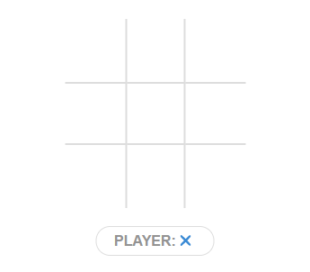
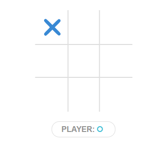
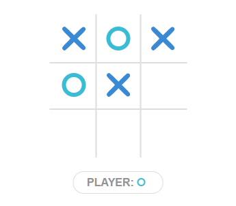
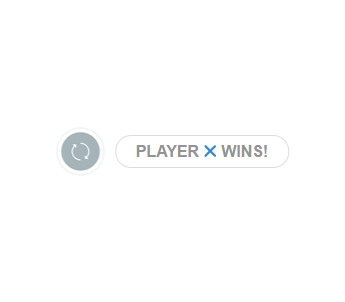
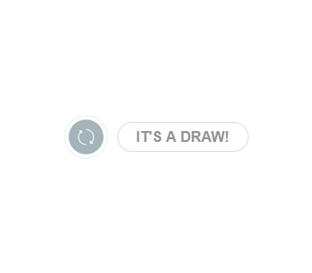

# How to get started

## Clone the repo

```sh
git clone https://github.com/toburger/tic-tac-toe--skeleton.git
```

## Either kickstart with `npm`

```sh
cd tic-tac-toe--skeleton
npm install
code . # open with the editor of your choice
npm start
```

## Otherwise kickstart with `yarn`

```sh
cd tic-tac-toe--skeleton
yarn
code . # open with the editor of your choice
yarn start
```

# Examples of the different states

## state1

Show the initial state:



## state2

Show the state after player 'X' made a move:



## state3

Show a more evolved board:



## state4

Show the state with a winner:



## state5

Show the state with a draw:

